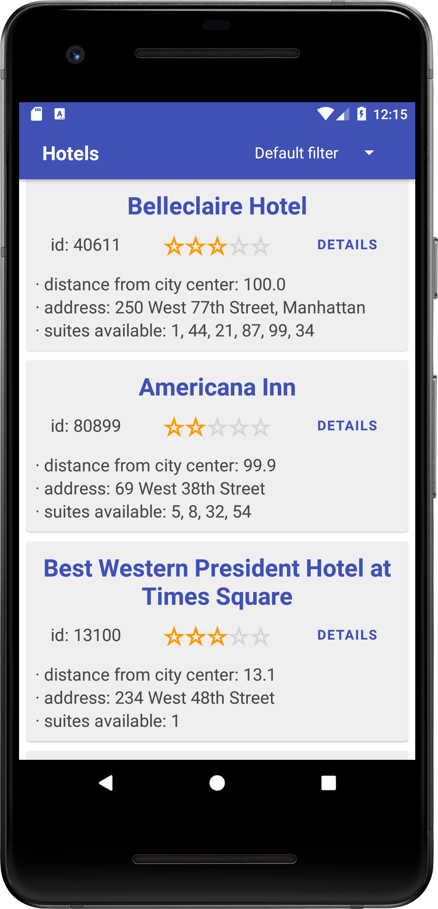
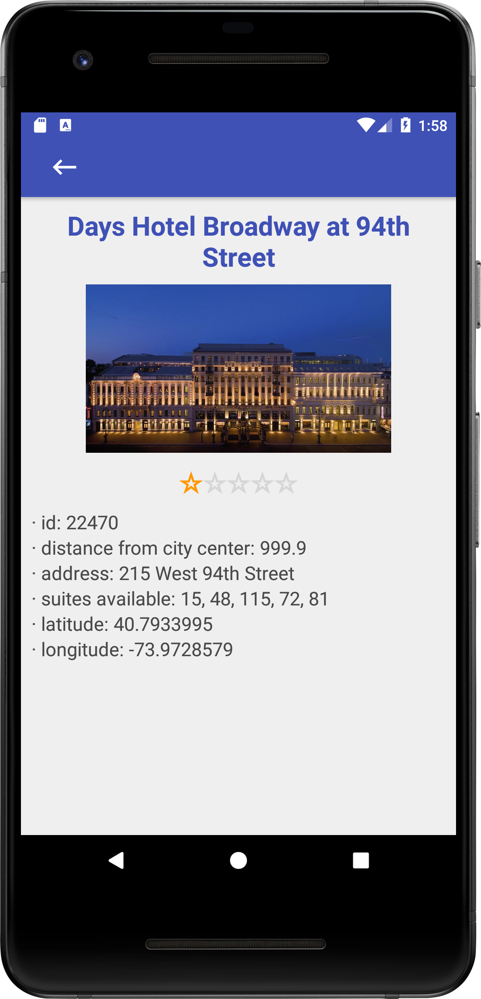

# JsonParserTestTask

My solution of the test task from a company

The task:

You need to write an application that downloads a JSON document from the server with
information about several hotels (API x), parses it and displays the data of these hotels.
The format for displaying this data is at the discretion of the developer.
While the data is being loaded, the user should be aware of this, respectively,
need to display progress indicator.

It must be possible to sort hotels by one of two
parameters: by the distance of the hotel from the city center or by the amount of available
rooms (the data is in the JSON document). Control for selecting the type of sorting 
is at the discretion of the developer. Primary sort must match
by issuing from the server.

It is also necessary to provide for the ability to view detailed information,
including an image (API xxx), about the hotel on a separate screen. Specific data
hotel can be obtained from a URL composed as follows (API xx, ID of 
each hotel is listed in the original JSON document). Format for displaying data about
the hotel is at the discretion of the developer. The hotel image has a border
edge 1px wide, you should avoid displaying this border in the interface.

The app must support Android 5.0 and above system. Orientations -
portrait and landscape. Important: be sure to follow the guidelines and
using standard controls (actionbars, spinners, buttons). The language is Kotlin.

API x - xxxxx.json - Original hotel list

API xx - xxxxN.json - Hotel, where N is the hotel ID. The "suites_availability" field contains the numbers of the available
hotel rooms separated by colons.

API xxx - xxxxM.jpg - Hotel picture, where M is the ID of the picture.

 
